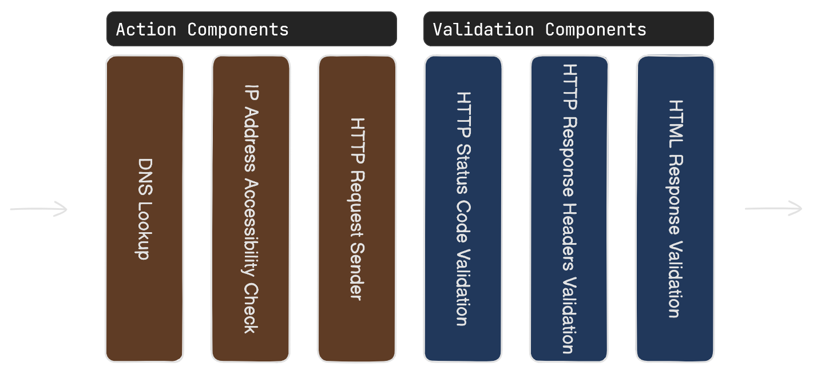

# The Testing Pipeline Explained

The @Xping.Sdk.Core.TestAgent executes the Xping SDK’s core testing logic, runs the pipeline, and collects the results. When your @Xping.Sdk.Core.TestAgent starts, it executes the test steps in its component container. A test step is an action or validation test component when it is added to the execution pipeline. The order of registration determines the order of execution. This order matters because each component can depend on the previous ones.

For example, the @Xping.Sdk.Actions.IPAddressAccessibilityCheck component needs the resolved IP addresses from the @Xping.Sdk.Actions.DnsLookup component. In general the validation components usually need the action components that come before them.

The figure below shows a typical testing pipeline for a web application.



You can omit any of these components, but some components require others to be registered. For instance, the validation components that check the response content need the @Xping.Sdk.Actions.HttpClientRequestSender or @Xping.Sdk.Actions.BrowserRequestSender component. They depend on the HTTP response results from this component.

> [!NOTE] 
> The testing pipeline maintains uniform functionality across different clients, ensuring that the results are consistent whether using [HttpClient](https://learn.microsoft.com/en-us/dotnet/api/system.net.http.httpclient) or a @Xping.Sdk.Core.Clients.Browser.BrowserClient. However, it should be noted that certain components may be specifically tailored to operate exclusively with one type of client.

## How to Register Test Components in the Testing Pipeline

All test components have a handy extension method to be registered in the testing pipeline. For instance, you can use `UseDnsLookup()` or `UseHtmlValidation()` to register @Xping.Sdk.Actions.DnsLookup and @Xping.Sdk.Validations.Content.Html.HtmlContentValidator components respectively. 

This can be done by executing the following code:

```csharp
var testAgent = host.Services.GetRequiredService<TestAgent>();

testAgent
    .UseDnsLookup()
    .UseIPAddressAccessibilityCheck()
    .UseHttpClient()
    .UseHttpValidation(response =>
    {
        Expect(response)
            .ToHaveSuccessStatusCode()
            .ToHaveResponseTimeLessThan(TimeSpan.FromSeconds(30))
            .ToHaveHeaderWithValue(HeaderNames.Server, value: "Google");
    })
    .UseHtmlValidation(html =>
    {
        html.HasMaxDocumentSize(MAX_SIZE_IN_BYTES);
    });
```

## Validating the Testing Pipeline

Before running the testing pipeline, it is crucial to ensure that it is configured properly. The @Xping.Sdk.Core.TestAgent class provides an API to probe the pipeline, which essentially checks all its test steps to confirm they are correctly configured. This validation feature is stateless and does not produce any test results. Instead, it returns a boolean value indicating whether the pipeline is configured properly.

#### Steps to Validate the Pipeline

1. <b>Configure the TestAgent</b>: by registering test steps into the component container.
2. <b>Probe the Pipeline</b>: Use the `ProbeAsync` method provided by the @Xping.Sdk.Core.TestAgent class to check the configuration of all test steps.
3. <b>Check the Result</b>: The method will return a boolean value: 
    - <b>true</b> if the pipeline is configured correctly.
    - <b>false</b> if there are any configuration issues.

#### Example Code

```csharp
// Configure the TestAgent
var testAgent = host.Services.GetRequiredService<TestAgent>();
testAgent
    .UseIPAddressAccessibilityCheck()
    .UseHttpValidation(response =>
    {
        Expect(response).ToHaveSuccessStatusCode();
    });

// Probe the pipeline
bool isPipelineConfiguredProperly = await testAgent.ProbeAsync(url, new TestSettings());

// Check the result
if (isPipelineConfiguredProperly)
{
    Console.WriteLine("The pipeline is configured properly.");
}
else
{
    Console.WriteLine("There are configuration issues in the pipeline.");
}
```

By following these steps, you can ensure that your testing pipeline is properly configured before execution, thereby avoiding potential issues during the testing process.

## How to Terminate the Pipeline

Each component runs either an action or a validation test operation. If the operation fails, the component fails. In this case, the component might terminate the pipeline and stop the execution of the remaining components. The @Xping.Sdk.Core.Session.TestSession reflects all the success and failed components. You can configure this behavior in the @Xping.Sdk.Core.Components.TestSettings by enabling the `ContinueOnFailure` property. If you enable this property, all the components in the pipeline will run regardless of the state of the other components.
