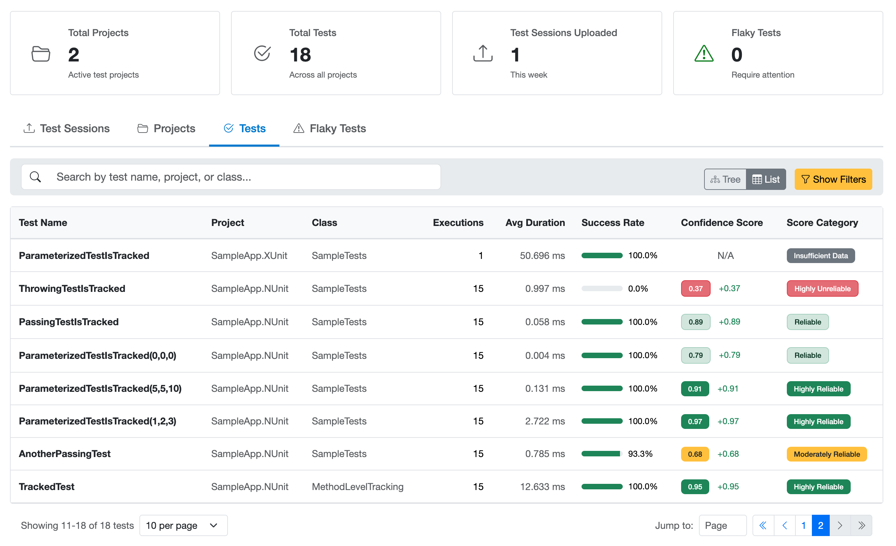
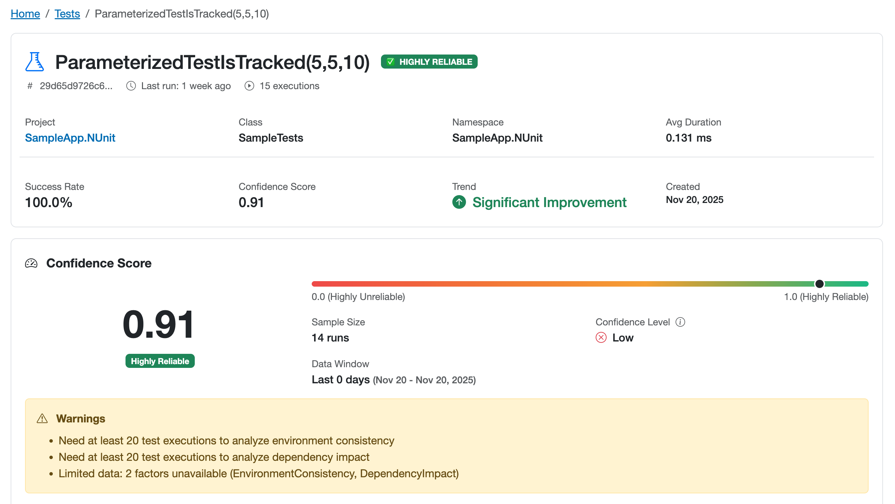

# Understanding Your Data

Once you've integrated the Xping SDK and your tests are running, the Xping Dashboard becomes your command center for understanding test reliability. This guide explains how to interpret the data Xping collects, navigate the dashboard, and understand confidence scores that help you identify unreliable tests.

## What Data Does Xping Collect?

The SDK collects comprehensive telemetry from every test execution. Each time a test runs, the following data is captured and uploaded to the Xping platform:

### Test Identity & Metadata
- **Test Identifier**: A stable SHA256 hash based on the fully qualified test name and parameters
- **Test Name**: The method name (e.g., `Add_TwoNumbers_ReturnsSum`)
- **Fully Qualified Name**: Complete namespace path to the test
- **Class Name & Namespace**: Organizational structure
- **Assembly**: The test project name
- **Categories & Tags**: Test classifications for filtering and organization
- **Description**: Test documentation (if provided)
- **Custom Attributes**: Additional metadata from test attributes

### Execution Details
- **Execution ID**: Unique identifier for each test run
- **Outcome**: Passed, Failed, Skipped, or Inconclusive
- **Duration**: How long the test took to execute
- **Start & End Times**: Precise UTC timestamps
- **Error Messages**: Failure details and exception messages
- **Stack Traces**: Failure location in code (when available)

### Environment Information
- **Machine Name**: Where the test executed
- **Operating System**: e.g., "Windows 11", "macOS 14.0", "Ubuntu 22.04"
- **Runtime Version**: .NET version (e.g., ".NET 8.0.0")
- **Test Framework**: NUnit, xUnit, MSTest with version numbers
- **Environment Name**: "Local", "CI", "Staging", "Production"
- **CI/CD Context**: Whether running in continuous integration

### Execution Context
- **Position in Suite**: Order of test execution
- **Global Position**: Position across all parallel threads
- **Worker ID**: Parallel execution worker/thread identifier
- **Test Suite ID**: Identifier grouping tests in the same run
- **Total Tests in Suite**: Size of the test suite
- **Suite Elapsed Time**: Time since test suite started
- **Collection/Fixture Name**: Framework-specific grouping

### Retry Information
- **Attempt Number**: 1 for first run, 2+ for retries
- **Total Attempts**: Maximum retry count configured
- **Retry Mechanism**: Type of retry (test framework, custom, CI)
- **Retry Result**: Whether retry succeeded or failed
- **Retry Delay**: Time between retry attempts
- **Additional Metadata**: Custom retry configuration details

### Network Metrics
- **Latency**: Network ping time in milliseconds
- **Online Status**: Whether network was available
- **Connection Type**: WiFi, Ethernet, Cellular, etc.
- **Packet Loss**: Network reliability percentage

This rich telemetry enables Xping to calculate confidence scores and detect patterns that indicate flaky tests, helping you build a reliable test suite.

## The Dashboard Overview

The Xping Dashboard provides multiple views for monitoring your test suite. After integrating the SDK and running tests, you'll see your data appear in the dashboard.

### Home Dashboard

The home page displays four tabs for different views of your test data:



#### Test Sessions Tab
Shows test run uploads from your CI/CD pipeline or local development:
- **Session Information**: When tests were executed and uploaded
- **Execution Statistics**: Total tests, passed/failed counts, success rate
- **Duration**: How long the test session took
- **Environment**: Where tests ran (CI, Local, Staging, etc.)
- **Framework**: Test framework and .NET runtime version

#### Projects Tab
Groups tests by project (test assembly):
- **Project Name**: Your test project/assembly name
- **Total Tests**: Number of tests in the project
- **Statistics**: Pass/fail rates and execution counts

#### Tests Tab
The primary view for all your tests. Available in two modes:

**List View** - Displays all tests with:
- **Test Name**: Method name and quick access link to details
- **Project & Class**: Organizational context
- **Total Executions**: How many times the test has run
- **Average Duration**: Typical execution time
- **Success Rate**: Percentage of passing executions with visual progress bar
- **Confidence Score**: Numerical score (0.00-1.00) with colored badge
- **Score Category**: Badge showing "Highly Reliable", "Reliable", "Moderately Reliable", "Unreliable", or "Highly Unreliable"

**Tree View** - Hierarchical display organizing tests by:
- **Project** → **Namespace** → **Class** → **Test Method**
- Makes it easy to navigate large test suites and see organizational structure
- All the same metrics as list view, organized hierarchically

#### Flaky Tests Tab
Focuses on tests that need attention:
- Filters to show only tests with low confidence scores (< 0.60 threshold)
- Same columns as Tests tab
- Helps you prioritize reliability improvements

### Filtering and Searching

All tabs provide filtering capabilities:
- **Search**: Find tests by name, project, or class
- **Score Category Filter**: Filter by reliability level
- **Success Rate Range**: Show tests within specific pass rate ranges
- **Confidence Score Range**: Filter by confidence score thresholds
- **Execution Count Range**: Find tests by how often they've run
- **Last Executed After**: Show recently run tests
- **Sorting**: Sort by any column (name, executions, success rate, confidence score, duration)
- **View Mode** (Tests tab only): Toggle between tree and list views

## Understanding Confidence Scores

The **confidence score** is Xping's primary metric for test reliability. It's a value between 0.0 and 1.0 that answers the question: *"Can I trust this test?"*

Every test that has at least 10 executions receives a confidence score. This score is calculated by analyzing multiple factors about test behavior and aggregating them into a single, easy-to-understand number.

### Confidence Score Ranges & Categories

Xping automatically categorizes tests based on their confidence score:

| Score Range | Category | Badge Color | Meaning |
|-------------|----------|-------------|---------|
| **0.90 - 1.00** | **Highly Reliable** | 🟢 Green | Excellent - Highly consistent behavior. Failures are almost certainly real bugs. |
| **0.75 - 0.89** | **Reliable** | 🟢 Light Green | Good - Mostly reliable with minor inconsistencies. Generally trustworthy. |
| **0.60 - 0.74** | **Moderately Reliable** | 🟡 Yellow | Fair - Shows some flakiness. Monitor for patterns. |
| **0.40 - 0.59** | **Unreliable** | 🟠 Orange | Poor - Significant flakiness detected. Investigate and fix. |
| **0.00 - 0.39** | **Highly Unreliable** | 🔴 Red | Critical - Severe flakiness. Fix urgently or disable. |

### Confidence Level: How Reliable is the Score?

In addition to the score itself, Xping shows a **Confidence Level** that indicates how statistically reliable the score calculation is. This is based on sample size:

| Confidence Level | Runs Required | Meaning |
|-----------------|---------------|---------|
| **No Data** | < 10 runs | Insufficient data - need more test executions |
| **Low** | 10-24 runs | Tentative determination - score may fluctuate |
| **Medium** | 25-49 runs | Reasonably reliable - recommended minimum for production |
| **High** | 50-99 runs | Very reliable determination - suitable for critical tests |
| **Very High** | 100+ runs | Extremely reliable - ideal for comprehensive analysis |

**Example:** A test showing "0.85 (High Confidence)" means:
- The test has a reliability score of 0.85 (Reliable category)
- This score is based on 50-99 test executions
- The score is statistically reliable and can be trusted

**Example:** A test showing "0.92 (Low Confidence)" means:
- The test has a high score of 0.92 (Highly Reliable category)
- But it's only based on 10-24 executions
- The score may change significantly as more data is collected

### Score Trends

Xping tracks how confidence scores change over time and displays trend indicators:

- **Significant Improvement** ⬆️ Green: Score increased by +10% or more
- **Minor Improvement** ↗️ Light Green: Score increased by +5% to +10%
- **Stable** ➡️ Gray: Score changed less than ±5%
- **Minor Degradation** ↘️ Orange: Score decreased by -5% to -10%
- **Significant Degradation** ⬇️ Red: Score decreased by -10% or more

Trends help you quickly spot tests that are getting better or worse over time.

### What Influences the Confidence Score?

The confidence score is calculated by analyzing multiple factors that examine different aspects of test behavior. The actual implementation uses a weighted algorithm that considers these key factors:

1. **Historical Pass Rate** (Highest Weight)
   - How often does the test pass across all executions?
   - 100% pass rate = maximum contribution
   - <80% pass rate = significant penalty
<p></p>

2. **Execution Stability**
   - Does the test take roughly the same time to run?
   - Are there unexpected performance spikes?
   - High variance in execution time reduces the score
<p></p>

3. **Retry Behavior**
   - Does the test fail initially but pass on retry?
   - Classic sign of flakiness
   - Frequent retry success significantly lowers the score
<p></p>

4. **Environment Consistency**
   - Does the test behave the same across different environments?
   - Local vs. CI, Windows vs. Linux vs. macOS
   - Environment-dependent failures indicate flakiness
<p></p>

5. **Failure Pattern Analysis**
   - Are failures random or predictable?
   - Do they correlate with time, load, or other factors?
   - Random failures are harder to fix and score lower
<p></p>

6. **Dependency Impact**
   - Do test failures correlate with other test failures?
   - Tests with shared dependencies that fail together
   - Indicates potential test isolation issues
<p></p>

### When Are Confidence Scores Calculated?

Confidence scores are calculated automatically after new test executions are uploaded:

1. **Initial Calculation**: After a test reaches 10 executions
2. **Recalculation Triggers**:
   - New test executions are uploaded (threshold-based)
   - Tests with changing behavior are prioritized
   - Scheduled recalculation for all active tests
<p></p>

3. **Minimum Data Requirements**:
   - **Overall**: At least 10 test executions
   - **Per Factor**: Some factors need more data (20+ runs for environment analysis)
   - **Insufficient Data**: Tests show "Insufficient Data" badge until minimum is met
<p></p>

## The Test Detail View

Clicking on any test in the dashboard takes you to a detailed analysis page. This page provides comprehensive insights about individual test behavior.



### Overview Section
- **Test Header**: Full test name, project, and class information
- **Primary Metrics Card**:
  - Current confidence score with visual badge
  - Confidence level indicator (sample size context)
  - Success rate with visual progress bar
  - Total executions count
  - Average execution duration
  - Last execution timestamp

### Confidence Score Breakdown
A detailed view showing how each factor contributed to the overall confidence score:
- **Factor Names**: Pass Rate, Execution Stability, Retry Behavior, etc.
- **Individual Scores**: Each factor's score (0.0-1.0)
- **Visual Progress Bars**: Color-coded based on score (green/yellow/red)
- **Sample Size**: How many executions were analyzed for each factor
- **Confidence Level**: Statistical confidence for each factor

This breakdown helps you understand **why** a test has a particular score.

### Execution History
A timeline of recent test executions showing:
- **Outcome**: Pass/fail status with visual indicators
- **Duration**: Execution time for each run
- **Environment**: Where the test executed (CI, Local, etc.)
- **Timestamp**: When the test ran
- **Attempt Number**: Whether it was a retry

### Environment Analysis
Compare test behavior across different execution environments:
- **Per-Environment Scores**: Separate confidence scores for Local, CI, etc.
- **Pass Rates**: Success rates in each environment
- **Sample Sizes**: Number of runs in each environment
- **Trends**: Score changes within each environment

This helps identify environment-specific issues.

### Flaky Detection Analysis
If the test is flagged as flaky, this section provides:
- **Flakiness Category**: Type of flakiness detected (Timing, Environment, Concurrency, etc.)
- **Root Cause Analysis**: Specific indicators found
- **Recommendations**: Actionable suggestions for fixing the issue
- **Confidence**: How certain the system is about the categorization

### Test Metadata
All collected information about the test:
- Test framework and version
- Categories and tags
- Custom attributes
- Description (if provided)

## Interpreting the Data

### Reading Confidence Scores

**High Scores (0.75+)**: These tests are reliable. When they fail, investigate the failure as it's likely a real bug.

**Medium Scores (0.60-0.74)**: These tests show some inconsistency. Monitor them and watch for trends:
- If the trend is improving (↗️ ⬆️), your fixes are working
- If stable (➡️), the test is consistently moderately reliable
- If degrading (↘️ ⬇️), prioritize investigation

**Low Scores (<0.60)**: These tests need attention, but a low score doesn't automatically mean the test is flaky. A test that consistently fails due to a genuine bug will also have a low confidence score. Xping distinguishes between consistently broken tests and flaky ones - only tests that exhibit flakiness patterns (inconsistent pass/fail behavior, retry dependencies, environment-specific issues) appear in the "Flaky Tests" tab. Consistently failing tests will show low scores but won't be flagged as flaky until they demonstrate unstable behavior.

### Confidence Level Matters

Always consider both the score and the confidence level:

| Scenario | Interpretation | Action |
|----------|---------------|--------|
| 0.95 (Very High) | Highly reliable, well-established pattern | Trust it completely |
| 0.95 (Low) | Looks good now, but limited data | Monitor as more data comes in |
| 0.45 (Very High) | Definitely flaky, strong evidence | Fix urgently |
| 0.45 (Low) | Possibly flaky, need more data | Let it run more, then reassess |

### Success Rate vs. Confidence Score

These are different metrics:

- **Success Rate**: Simple pass/fail percentage
  - Example: 85% means 85 of last 100 runs passed
  
- **Confidence Score**: Holistic reliability assessment
  - Considers pass rate **plus** execution consistency, retry patterns, environment behavior, etc.
  - Example: A test with 100% pass rate but high retry rate will have a lower confidence score

**Why the difference matters:**
A test can have a high success rate but low confidence score if it frequently needs retries or shows inconsistent execution times. Xping flags this because it indicates underlying instability.

### Trend Indicators

Trend arrows show score movement:

**Improving Tests** (↗️ ⬆️):
```
Week 1: 0.55 → Week 2: 0.72 → Week 3: 0.88 
Your fixes are working! Continue monitoring.
```

**Stable Tests** (➡️):
```
Week 1: 0.45 → Week 2: 0.47 → Week 3: 0.46
Chronically flaky - not improving. Consider rewrite.
```

**Degrading Tests** (↘️ ⬇️):
```
Week 1: 0.95 → Week 2: 0.82 → Week 3: 0.71
Something changed recently. Investigate code changes.
```

## Taking Action on Low Confidence Tests

When you identify tests with low confidence scores (< 0.60), follow this workflow:

### 1. Review the Test Detail Page

Navigate to the test detail page to understand:
- **Which factors are pulling the score down?** Look at the factor breakdown
- **What's the confidence level?** If it's Low or Medium, you may need more data
- **What's the trend?** Is it getting worse or has it always been flaky?

### 2. Check Environment Analysis

If "Environment Consistency" has a low score:
- Compare pass rates across Local vs. CI
- Look for environment-specific failures
- Common causes:
  - File path differences (Windows backslashes vs. Unix forward slashes)
  - Environment variables not set in CI
  - Network connectivity differences
  - Timing differences (CI machines may be slower)

### 3. Examine Execution History

Look for patterns in recent executions:
- Do failures happen at specific times of day?
- Do they occur during parallel execution?
- Do they correlate with high system load?
- Are certain environments more problematic?

### 4. Review Retry Behavior

If "Retry Behavior" scores low:
- The test is failing initially but passing on retry
- Classic sign of timing issues or race conditions
- Fix: Add explicit waits, improve test isolation, or fix synchronization

### 5. Check for Common Flakiness Patterns

Common patterns and their fixes:

**Timing/Race Conditions:**
- Symptom: Passes on retry, high execution time variance
- Fix: Replace arbitrary delays with explicit waits for conditions

**Environment Dependencies:**
- Symptom: Works locally, fails in CI (or vice versa)
- Fix: Mock external dependencies, ensure consistent environment setup

**Test Isolation Issues:**
- Symptom: Failures correlate with other test failures
- Fix: Ensure proper setup/teardown, avoid shared state

**Resource Contention:**
- Symptom: Fails when run in parallel, passes when run alone
- Fix: Use unique resources per test, improve cleanup

**External Service Flakiness:**
- Symptom: Network-related errors, timeouts
- Fix: Mock external services in unit/integration tests

### 6. Monitor After Fixes

After implementing fixes:
1. Let the test run at least 20-30 more times
2. Watch the confidence score trend
3. Verify the score moves toward Reliable or Highly Reliable
4. Check that the problematic factor scores improve

**Expected timeline:**
- **Immediate**: Recent executions show fewer failures
- **3-5 days**: Pass rate improves noticeably
- **1-2 weeks**: Confidence score reflects new stability
- **2-4 weeks**: Consistent high score confirms the fix

## Best Practices for Using the Dashboard

### Daily Quick Check (2-3 minutes)
1. Check the **Flaky Tests** tab for new entries
2. Review tests with declining confidence scores (red ↘️ or ⬇️ arrows)
3. Acknowledge any critical issues (scores below 0.40)

### Weekly Review (15-20 minutes)
1. Review the **Tests** tab sorted by confidence score (ascending)
2. Identify top 3-5 lowest-scoring tests
3. Prioritize based on:
   - How critical the test is
   - How frequently it runs
   - Whether score is improving or degrading
4. Create tickets for fixing problematic tests
5. Check if previous fixes are showing improvement (trending up)

### Monthly Health Assessment (30-45 minutes)
1. Generate overview metrics:
   - How many tests in each category (Highly Reliable, Reliable, etc.)?
   - How has the overall distribution changed from last month?
   - What percentage of tests are in the Flaky Tests tab?
2. Identify systemic issues:
   - Are multiple tests showing the same failure pattern?
   - Are environment-specific issues widespread?
   - Is there a particular project/namespace with many flaky tests?
3. Celebrate wins:
   - Tests that moved from Unreliable to Reliable
   - Tests with significant improvement trends
   - Decrease in overall flaky test count

### Team Practices

**Make Confidence Scores Visible:**
- Include confidence scores in PR reviews
- Set minimum confidence thresholds (e.g., don't merge if new tests < 0.60 after 20 runs)
- Display dashboard in team area or standups

**Don't Ignore Low Scores:**
- Flaky tests waste more time than they save
- They erode trust in the entire test suite
- They hide real bugs behind "probably just flaky" assumptions

**Fix at the Source:**
- Don't just add retries to mask flakiness
- Identify and fix the root cause
- Use retry only as a temporary measure while fixing

**Document Learnings:**
- When you fix a flaky test, document what you learned
- Share patterns with the team
- Build a team knowledge base of common flakiness causes

**Set Quality Standards:**
- Define minimum acceptable confidence scores for different test types
  - Critical path tests: 0.85+
  - Integration tests: 0.75+
  - All tests: 0.60+ (below this goes to Flaky Tests tab)
- Don't merge code that introduces low-confidence tests

## Common Questions

### Q: Why is my passing test showing a low confidence score?
**A:** Confidence isn't just about pass/fail. A test that passes 100% of the time but requires retries, has wildly varying execution times, or only passes in certain environments will have a lower confidence score. Xping is telling you the test is unreliable even if it technically passes eventually.

### Q: How long does it take to get a confidence score?
**A:** You need at least 10 test executions before a confidence score is calculated. After 10 runs, you'll see a score with "Low Confidence" level. The score becomes more reliable as you accumulate more executions:
- 25+ runs: Medium Confidence
- 50+ runs: High Confidence  
- 100+ runs: Very High Confidence

### Q: My test has a low score but I know why it's flaky. Can I override it?
**A:** No, confidence scores are calculated objectively based on actual behavior. However, you can:
- Add tags/categories to provide context (e.g., `[Category("external-service")]`)
- Use filters to exclude these tests from your main view
- Create separate test suites for inherently unstable tests (like external service health checks)
- Focus on improving the test rather than overriding the score

### Q: What's the difference between Success Rate and Confidence Score?
**A:** 
- **Success Rate**: Simple percentage of passed executions (e.g., 85 passed out of 100 = 85%)
- **Confidence Score**: Holistic reliability assessment that considers pass rate, execution consistency, retry behavior, environment consistency, and more

A test with 100% success rate can have a low confidence score if it frequently needs retries or shows inconsistent behavior.

### Q: Should I disable all tests below 0.60?
**A:** Not necessarily. First, understand **why** the score is low:
- Check the confidence level - is it based on enough data?
- Review the factor breakdown - which specific factors are problematic?
- Look at the trend - is it improving?

Then decide:
- If it's providing value and failures are legitimate → Fix the flakiness
- If it's flaky and nobody trusts it → Fix or disable
- If it's testing something inherently unstable → Reconsider test design or move to a separate suite

### Q: How do I share a specific test's data with my team?
**A:** Each test has a unique URL (e.g., `/tests/{test-id}`). Copy and share this URL in your issue tracker, pull request, or team chat. Anyone with access to the dashboard can view the full test details.

### Q: Can I get notifications when a test's confidence drops?
**A:** The current implementation calculates scores and flags low-confidence tests in the Flaky Tests tab. Check your dashboard regularly, or consider implementing your own alerting using the Xping API. Future versions may include built-in alerting capabilities.

### Q: Why does a test show "Insufficient Data"?
**A:** The test hasn't reached the minimum 10 executions required for confidence score calculation. Keep running your tests, and once it hits 10 executions, you'll see a confidence score appear.

### Q: The confidence score seems wrong. What should I do?
**A:** 
1. Check the **Confidence Level** - if it's Low, the score may change significantly as more data is collected
2. Review the **Factor Breakdown** to see which factors are affecting the score
3. Verify the **Sample Size** - small samples can be less accurate
4. Look at the **Execution History** to verify the data matches reality

If something still seems incorrect, this may indicate an edge case worth investigating further.

## Next Steps

Now that you understand how to read and interpret your data, you can start using the dashboard to monitor and improve your test suite reliability.

---

**Remember:** The dashboard is your diagnostic tool for test reliability. Regular monitoring helps you maintain a trustworthy test suite where failures are meaningful signals, not noise. Start by checking the Flaky Tests tab daily, and work systematically to improve the lowest-scoring tests first.
